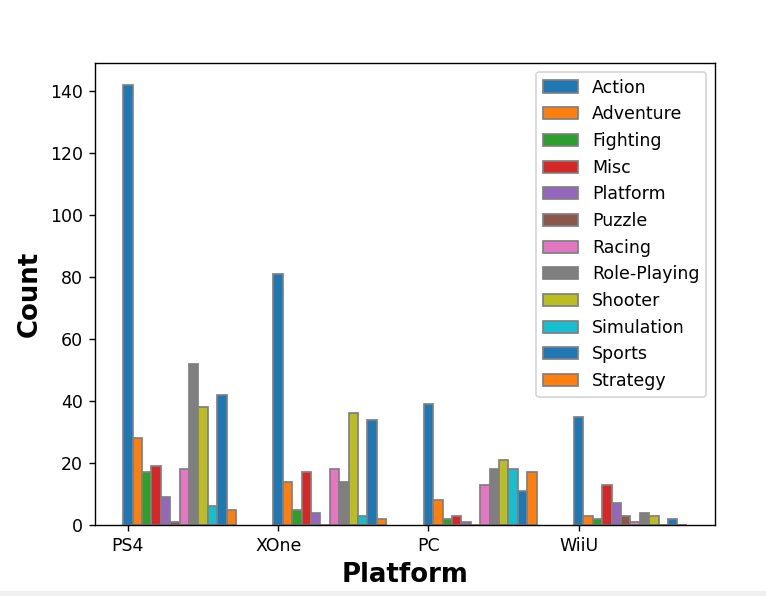
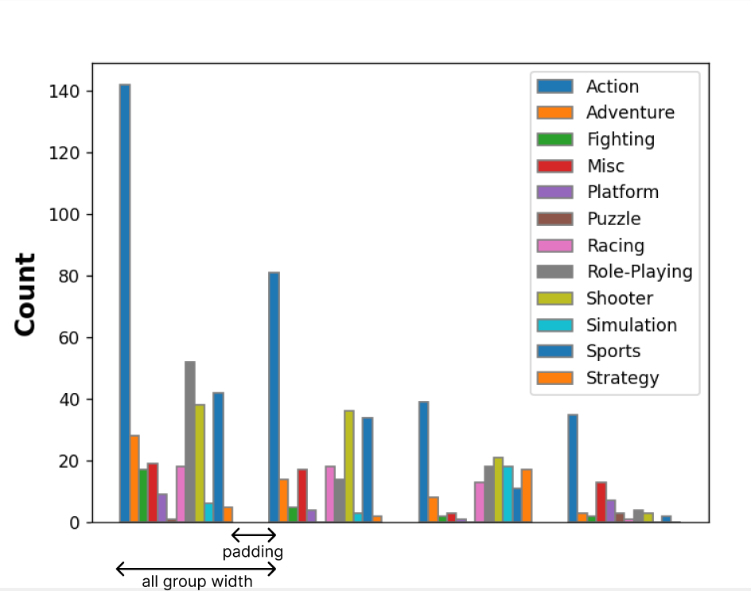

The goal of this task is to create you own game chart by genres  
Our end goal is something like this: 

You can use any widths, but I suggest sizes in main.py:

    singleBarWidth = 0.25
    barPadding = 1
    allBarWidth = singleBarWidth * len(gameGenres) + barPadding

Feel free to change the styling with other matplotlib functions.

    First of all you need to create arrays with all column positions with the same shape as gamesCounters accordingly (12,4)
    For example:
    <pre>
    [[0,  3,   6,   9   ],
    [0.25,3.25,6.25,9.25],
    ...]
    </pre>
    

  Try using plt.bar() function with positions and gameCounters, that you get from parsing the dataset

Hint 3 is a complete solution

    # writing bar positions 
    for genreIndex in range(len(game_genres)):  # looping through genres
        for platformsIndex in range(len(platforms)):  # looping through platforms
            bar_positions[genreIndex, platformsIndex] = platformsIndex * all_bar_width + genreIndex * single_bar_width

    # setting up bar for every game genres
    for i, genre in enumerate(game_genres):  # loop through genres
        plt.bar(bar_positions[i], gamesCounters[i], width=single_bar_width, edgecolor='grey', label=genre)

    # setting up labels
    plt.xlabel('Platform', fontweight='bold', fontsize=15)
    plt.ylabel('Count', fontweight='bold', fontsize=15)

    # setting up sub-labels with platform names
    plt.xticks([i * all_bar_width for i in range(len(platforms))],
               platforms)

    plt.legend()  # showing legend
    plt.show()  # showing the result

